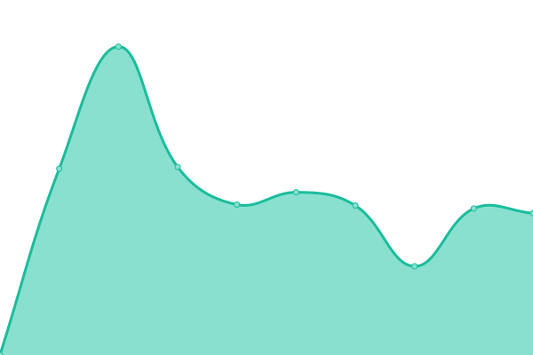

# [📈 Live Status](https://lightfreedomadmin.github.io/Upptime): <!--live status--> **🟩 All systems operational**

This repository contains the open-source uptime monitor and status page for [lightfreedomadmin](https://lightfreedomadmin.github.io/Upptime), powered by [Upptime](https://github.com/upptime/upptime).

With [Upptime](https://upptime.js.org), you can get your own unlimited and free uptime monitor and status page, powered entirely by a GitHub repository. We use [Issues](https://github.com/lightfreedomadmin/Upptime/issues) as incident reports, [Actions](https://github.com/lightfreedomadmin/Upptime/actions) as uptime monitors, and [Pages](https://lightfreedomadmin.github.io/Upptime) for the status page.

<!--start: status pages-->
<!-- This summary is generated by Upptime (https://github.com/upptime/upptime) -->
<!-- Do not edit this manually, your changes will be overwritten -->
<!-- prettier-ignore -->
| URL | Status | History | Response Time | Uptime |
| --- | ------ | ------- | ------------- | ------ |
|  [HDS Brisbane](https://www.hdsbrisbane.com.au) | 🟩 Up | [hds-brisbane.yml](https://github.com/lightfreedomadmin/Upptime/commits/HEAD/history/hds-brisbane.yml) | 

 3227ms
     
 | 

<a href="https://lightfreedomadmin.github.io/Upptime/history/hds-brisbane">98.71%</a>
    

|  [Pipli](https://www.pipli.com.au) | 🟩 Up | [pipli.yml](https://github.com/lightfreedomadmin/Upptime/commits/HEAD/history/pipli.yml) | 

 450ms
     
 | 

<a href="https://lightfreedomadmin.github.io/Upptime/history/pipli">100.00%</a>
    

|  [In Mind Therapy](https://www.inmindtherapy.com.au) | 🟩 Up | [in-mind-therapy.yml](https://github.com/lightfreedomadmin/Upptime/commits/HEAD/history/in-mind-therapy.yml) | 

 1335ms
     
 | 

<a href="https://lightfreedomadmin.github.io/Upptime/history/in-mind-therapy">99.59%</a>
    

|  [Budget Sign Panels](https://budgetsignpanels.com.au) | 🟩 Up | [budget-sign-panels.yml](https://github.com/lightfreedomadmin/Upptime/commits/HEAD/history/budget-sign-panels.yml) | 

 5509ms
     
 | 

<a href="https://lightfreedomadmin.github.io/Upptime/history/budget-sign-panels">100.00%</a>
    

|  [BusinessBrokers](https://businessbrokers.com.au) | 🟩 Up | [business-brokers.yml](https://github.com/lightfreedomadmin/Upptime/commits/HEAD/history/business-brokers.yml) | 

 1250ms
     
 | 

<a href="https://lightfreedomadmin.github.io/Upptime/history/business-brokers">99.58%</a>
    

|  [Coverall.net.au](https://coverall.net.au) | 🟩 Up | [coverall-net-au.yml](https://github.com/lightfreedomadmin/Upptime/commits/HEAD/history/coverall-net-au.yml) | 

 2867ms
     
 | 

<a href="https://lightfreedomadmin.github.io/Upptime/history/coverall-net-au">99.58%</a>
    

|  [CtoC.com.au](https://www.ctoc.com.au) | 🟩 Up | [cto-c-com-au.yml](https://github.com/lightfreedomadmin/Upptime/commits/HEAD/history/cto-c-com-au.yml) | 

 1044ms
     
 | 

<a href="https://lightfreedomadmin.github.io/Upptime/history/cto-c-com-au">99.58%</a>
    

|  [EliteMMA.net.au](https://www.elitemma.net.au) | 🟩 Up | [elite-mma-net-au.yml](https://github.com/lightfreedomadmin/Upptime/commits/HEAD/history/elite-mma-net-au.yml) | 

 1859ms
     
 | 

<a href="https://lightfreedomadmin.github.io/Upptime/history/elite-mma-net-au">99.58%</a>
    

|  [ExpertAV.com.au](https://www.expertav.com.au) | 🟩 Up | [expert-av-com-au.yml](https://github.com/lightfreedomadmin/Upptime/commits/HEAD/history/expert-av-com-au.yml) | 

 3892ms
     
 | 

<a href="https://lightfreedomadmin.github.io/Upptime/history/expert-av-com-au">99.58%</a>
    

|  [JohnLagoudakis.com](https://johnlagoudakis.com) | 🟩 Up | [john-lagoudakis-com.yml](https://github.com/lightfreedomadmin/Upptime/commits/HEAD/history/john-lagoudakis-com.yml) | 

 1762ms
     
 | 

<a href="https://lightfreedomadmin.github.io/Upptime/history/john-lagoudakis-com">99.58%</a>
    

|  [LF.asn.au](https://lf.asn.au) | 🟩 Up | [lf-asn-au.yml](https://github.com/lightfreedomadmin/Upptime/commits/HEAD/history/lf-asn-au.yml) | 

 1880ms
     
 | 

<a href="https://lightfreedomadmin.github.io/Upptime/history/lf-asn-au">99.51%</a>
    

|  [LocalForYou.com](https://localforyou.com) | 🟩 Up | [local-for-you-com.yml](https://github.com/lightfreedomadmin/Upptime/commits/HEAD/history/local-for-you-com.yml) | 

 2929ms
     
 | 

<a href="https://lightfreedomadmin.github.io/Upptime/history/local-for-you-com">99.59%</a>
    

|  [marriagematters.com.au](https://marriagematters.com.au) | 🟩 Up | [marriagematters-com-au.yml](https://github.com/lightfreedomadmin/Upptime/commits/HEAD/history/marriagematters-com-au.yml) | 

 2097ms
     
 | 

<a href="https://lightfreedomadmin.github.io/Upptime/history/marriagematters-com-au">99.58%</a>
    

|  [MyBusinessValuation.com.au](https://www.mybusinessvaluation.com.au) | 🟩 Up | [my-business-valuation-com-au.yml](https://github.com/lightfreedomadmin/Upptime/commits/HEAD/history/my-business-valuation-com-au.yml) | 

 5399ms
     
 | 

<a href="https://lightfreedomadmin.github.io/Upptime/history/my-business-valuation-com-au">100.00%</a>
    

|  [Natures Trinity](https://naturestrinity.com) | 🟩 Up | [natures-trinity.yml](https://github.com/lightfreedomadmin/Upptime/commits/HEAD/history/natures-trinity.yml) | 

 3063ms
     
 | 

<a href="https://lightfreedomadmin.github.io/Upptime/history/natures-trinity">99.58%</a>
    

|  [nicksonbourke.com.au](https://nicksonbourke.com.au) | 🟩 Up | [nicksonbourke-com-au.yml](https://github.com/lightfreedomadmin/Upptime/commits/HEAD/history/nicksonbourke-com-au.yml) | 

 1598ms
     
 | 

<a href="https://lightfreedomadmin.github.io/Upptime/history/nicksonbourke-com-au">99.58%</a>
    

|  [PantexRoofing.Com.Au](https://pantexroofing.com.au) | 🟩 Up | [pantex-roofing-com-au.yml](https://github.com/lightfreedomadmin/Upptime/commits/HEAD/history/pantex-roofing-com-au.yml) | 

 6791ms
     
 | 

<a href="https://lightfreedomadmin.github.io/Upptime/history/pantex-roofing-com-au">86.06%</a>
    

|  [Pinocchios.com.au](https://pinocchios.com.au) | 🟩 Up | [pinocchios-com-au.yml](https://github.com/lightfreedomadmin/Upptime/commits/HEAD/history/pinocchios-com-au.yml) | 

 1879ms
     
 | 

<a href="https://lightfreedomadmin.github.io/Upptime/history/pinocchios-com-au">99.59%</a>
    

|  [qldflooring.com.au](https://qldflooring.com.au) | 🟩 Up | [qldflooring-com-au.yml](https://github.com/lightfreedomadmin/Upptime/commits/HEAD/history/qldflooring-com-au.yml) | 

 1619ms
     
 | 

<a href="https://lightfreedomadmin.github.io/Upptime/history/qldflooring-com-au">90.69%</a>
    

|  [QuantumMartialArts.com.au](https://quantummartialarts.com.au) | 🟩 Up | [quantum-martial-arts-com-au.yml](https://github.com/lightfreedomadmin/Upptime/commits/HEAD/history/quantum-martial-arts-com-au.yml) | 

 1333ms
     
 | 

<a href="https://lightfreedomadmin.github.io/Upptime/history/quantum-martial-arts-com-au">99.84%</a>
    

|  [RappelMail.com](https://rappelmail.com) | 🟩 Up | [rappel-mail-com.yml](https://github.com/lightfreedomadmin/Upptime/commits/HEAD/history/rappel-mail-com.yml) | 

 1724ms
     
 | 

<a href="https://lightfreedomadmin.github.io/Upptime/history/rappel-mail-com">99.60%</a>
    

|  [SignAgeQLD.com.au](https://signageqld.com.au) | 🟩 Up | [sign-age-qld-com-au.yml](https://github.com/lightfreedomadmin/Upptime/commits/HEAD/history/sign-age-qld-com-au.yml) | 

 1571ms
     
 | 

<a href="https://lightfreedomadmin.github.io/Upptime/history/sign-age-qld-com-au">100.00%</a>
    

|  [solutionsempowerment.org](https://solutionsempowerment.org) | 🟩 Up | [solutionsempowerment-org.yml](https://github.com/lightfreedomadmin/Upptime/commits/HEAD/history/solutionsempowerment-org.yml) | 

 1591ms
     
 | 

<a href="https://lightfreedomadmin.github.io/Upptime/history/solutionsempowerment-org">100.00%</a>
    

|  [towingchch.co.nz](https://www.towingchch.co.nz) | 🟩 Up | [towingchch-co-nz.yml](https://github.com/lightfreedomadmin/Upptime/commits/HEAD/history/towingchch-co-nz.yml) | 

 340ms
     
 | 

<a href="https://lightfreedomadmin.github.io/Upptime/history/towingchch-co-nz">100.00%</a>
    

|  [ValetMortgageBrokers.com](https://valetmortgagebrokers.com.au) | 🟩 Up | [valet-mortgage-brokers-com.yml](https://github.com/lightfreedomadmin/Upptime/commits/HEAD/history/valet-mortgage-brokers-com.yml) | 

 1732ms
     
 | 

<a href="https://lightfreedomadmin.github.io/Upptime/history/valet-mortgage-brokers-com">99.60%</a>
    

|  [wm.com.au](https://wm.com.au) | 🟩 Up | [wm-com-au.yml](https://github.com/lightfreedomadmin/Upptime/commits/HEAD/history/wm-com-au.yml) | 

 1028ms
     
 | 

<a href="https://lightfreedomadmin.github.io/Upptime/history/wm-com-au">99.60%</a>
    

|  [xcllusive.com.au](https://www.xcllusive.com.au) | 🟩 Up | [xcllusive-com-au.yml](https://github.com/lightfreedomadmin/Upptime/commits/HEAD/history/xcllusive-com-au.yml) | 

 4044ms
     
 | 

<a href="https://lightfreedomadmin.github.io/Upptime/history/xcllusive-com-au">99.78%</a>
    

|  [xcllusivestays.com.au](https://xcllusivestays.com.au) | 🟩 Up | [xcllusivestays-com-au.yml](https://github.com/lightfreedomadmin/Upptime/commits/HEAD/history/xcllusivestays-com-au.yml) | 

 1750ms
     
 | 

<a href="https://lightfreedomadmin.github.io/Upptime/history/xcllusivestays-com-au">99.60%</a>
    

|  [yournextbigmove.com.au](https://yournextbigmove.com.au) | 🟩 Up | [yournextbigmove-com-au.yml](https://github.com/lightfreedomadmin/Upptime/commits/HEAD/history/yournextbigmove-com-au.yml) | 

 2183ms
     
 | 

<a href="https://lightfreedomadmin.github.io/Upptime/history/yournextbigmove-com-au">99.60%</a>
    

<!--end: status pages-->

[**Visit our status website →**](https://lightfreedomadmin.github.io/Upptime)

## 📄 License

- Powered by: [Upptime](https://github.com/upptime/upptime)
- Code: [MIT](./LICENSE) © [Anand Chowdhary](https://anandchowdhary.com), supported by [Pabio](https://pabio.com)
- Data in the `./history` directory: [Open Database License](https://opendatacommons.org/licenses/odbl/1-0/)
